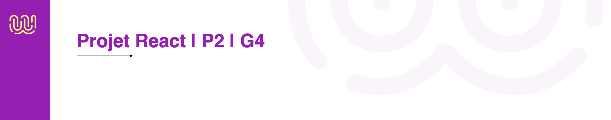

## Hi there, i'm G4. Welcome to my page. 👋

## Team :

Nous sommes l'équipe de développeurs la plus affamée de code que vous ayez jamais rencontrée. Coder pour nous, c'est comme manger des bonbons. Alors, naturellement, nous sommes sur le point de concocter une application React délicieusement géniale. Attendez-vous à une expérience gustative numérique hors du commun !

- Meriem
- Hugo
- Nicolas

## Objectifs

- que toute les features soient fonctionnelles.
- Respecter la maquette
- Bien utiliser l'API, que ce soit fonctionnelle.
- Pratiquer React et la manipulation de components
- Respecter la Deadline
- Que toute l'équipe apporte sa plus value au projet
- Se faire plaisir

## workflow

### Nomenclature des branches :

- Branche principale `main` : code testé et fonctionnel | fusion à partir dev
- Branche dev `dev` fusion des fonctionnalités à partir des branches fonctionnelles
- Branche de fonctionnalité `Feature/US`
- Chaque merge vers `dev`, Créer une Pull-Request(PR)

## Méthode Agile

#### Sprint d'une semaine

- daily de groupe tous les matins
- review tous les vendredis (main présenté)
- rétrospective de groupe tous les vendredis après midi
- suivi du sprint planning pour préparer le sprint suivant

#### Rôles

- tout le monde est développeur, mais en plus chaque sprint, les rôles tournent
- 1 Product Owner : gestion du backlog, présentation du projet
- 1 Scrum Master : veille au bon respect du Scrum (daily, anime la rétrospective)
